# Descripcion del Workflow de Deploy

Este documento describe el workflow [.github/workflows/deploy-aws-module-1.yml](.github/workflows/deploy-aws-module-1.yml) como una automatizacion por etapas de la plataforma BuyTime sobre AWS y F5 Distributed Cloud. El objetivo del pipeline es construir una topologia distribuida en tres pasos: primero el Retail Branch sobre App Stack, despues la base de Customer Edge para cargas compartidas y finalmente la publicacion del servicio de Lightning Deals.

La secuencia esta pensada para que cada etapa agregue infraestructura utilizable sin reprovisionar innecesariamente lo ya creado. `module-1` levanta el branch con su App Stack site, su mK8s, la VM kiosk y la aplicacion de sucursal. `module-2` extiende esa base con el CE site, los virtual sites, el vK8s y el modulo de sincronizacion. `module-3` reutiliza esos foundations para desplegar el servicio de deals y exponerlo por HTTP.

Visto desde la topologia que crea, el workflow hace lo siguiente:

- `module-1`: prepara la base del branch, crea o reutiliza App Stack y mK8s, despliega el kiosk y lo conecta con el servicio de recomendaciones.
- `module-2`: completa la parte de Customer Edge necesaria para BuyTime Online, despliega el modulo de sincronizacion y habilita la conectividad TCP hacia inventario.
- `module-3`: reutiliza las foundations anteriores para publicar el servicio de deals en vK8s y exponerlo mediante un HTTP load balancer.

Ademas del aprovisionamiento, la version actual del workflow agrega controles operativos para cerrar cada etapa con un entorno funcional: valida el estado final de los recursos, configura automaticamente los plugins BuyTime dentro de WordPress, crea el CE site en un job separado sin adelantar foundations de Module 2, espera a que ese CE site quede operativo, reutiliza recursos XC ya existentes cuando corresponde y deja un resumen operativo al finalizar cada ejecucion.

Las dependencias consumidas por el workflow se estan consolidando bajo `aws-mk8s-vk8s/`. En particular, el stack de CE usado por el job `ce_prerequisites` ya se ejecuta desde `aws-mk8s-vk8s/aws-ce-site`.

## Escenario

La plataforma BuyTime representa una arquitectura distribuida de retail y eCommerce donde una misma base aplicativa se extiende entre Retail Branch, Customer Edge y Regional Edge. El punto de partida es una aplicacion tradicional de tres capas, basada en WordPress, WooCommerce y MySQL, que se adapta a dos contextos operativos distintos.

En el Retail Branch, el foco esta en la experiencia de Kiosk para tienda fisica. Ese entorno necesita desplegarse de forma repetible, operar con una topologia estandar y conectarse con rapidez a servicios auxiliares, como el Recommendation Service y la base central de inventario. En la capa online, el foco cambia hacia servicios compartidos y promociones sensibles a la latencia, donde la conectividad entre Customer Edge, vK8s y el plano de exposicion de XC pasa a ser parte central de la arquitectura.

Este workflow toma ese escenario y lo convierte en una secuencia staged. En vez de describir un laboratorio conceptual, automatiza los recursos concretos que permiten pasar de una sucursal funcional a una topologia distribuida con sincronizacion e integracion de Lightning Deals.

## Casos de uso y Module Overview

Los tres modulos del workflow responden a tres casos de uso distintos dentro de la misma plataforma BuyTime. Cada uno agrega una capacidad tecnica nueva sobre la infraestructura ya creada.

### Module 1: Retail Branch Kiosk and Recommendation Service

El primer caso de uso es el Retail Branch operando sobre App Stack con una experiencia Kiosk basada en mK8s. Aqui el workflow crea o reutiliza la base del branch, despliega la aplicacion de tres capas y publica dos dominios internos: uno para el frontend Kiosk y otro para el Recommendation Service.

Desde el punto de vista funcional, este modulo resuelve dos necesidades: exponer la experiencia de sucursal de forma consistente y conectar esa experiencia con un backend de Recommendation Service sin depender de configuracion manual posterior en WordPress. El resultado es un branch operativo, con validaciones de readiness y smoke tests incluidos.

### Module 2: Synchronization Module with Customer Edge

El segundo caso de uso se centra en la conectividad entre la sucursal y los servicios compartidos de BuyTime Online. Para eso, el workflow extiende el dominio de Customer Edge con su VPC dedicada, crea o reutiliza namespace, virtual sites y vK8s, y despliega el Synchronization Module junto con un TCP load balancer.

La funcion principal de esta etapa es habilitar el intercambio de informacion con el inventario central mediante una topologia mas cercana al trafico real de aplicacion. No solo se crean los objetos de red y de compute necesarios, sino que tambien se valida la conectividad TCP desde el branch y se actualiza la configuracion del plugin correspondiente en WordPress.

### Module 3: Lightning Deals Service and Public Exposure

El tercer caso de uso agrega la capa de promociones online sensibles a latencia. Sobre el vK8s ya disponible, el workflow despliega el Lightning Deals service, crea o reutiliza su origin pool y publica un HTTP load balancer accesible por `deals.<user_domain>`.

Esta etapa completa la topologia online del laboratorio: el branch ya no solo consume Recommendation Service y Synchronization Module, sino que tambien puede integrarse con una experiencia de Lightning Deals publicada hacia usuarios finales. El workflow cierra el ciclo validando el health endpoint del servicio y dejando actualizada la configuracion del plugin en WordPress.

## Nombre del workflow

`Deploy AWS Staged Modules`

## Como se ejecuta

El workflow se ejecuta manualmente mediante `workflow_dispatch`.

Recibe un input manual llamado `deployment_stage`, con estas opciones:

- `module-1`
- `module-2`
- `module-3`

Actualmente estan implementadas las etapas `module-1`, `module-2` y `module-3`. Toda la configuracion de infraestructura sigue saliendo de variables y secretos del repositorio.

## Workflow adicional para segunda sucursal

Ademas del workflow principal, el repositorio incluye el workflow [.github/workflows/deploy-aws-second-branch.yml](.github/workflows/deploy-aws-second-branch.yml) para desplegar una segunda sucursal Retail Branch sin modificar el workflow staged principal.

Como complemento, tambien existe el workflow [.github/workflows/destroy-aws-second-branch.yml](.github/workflows/destroy-aws-second-branch.yml) para desmontar esa sucursal derivada sin afectar la sucursal primaria ni el workflow staged principal. En su forma actual, este destroy no pide inputs manuales: deriva el namespace `-b`, reutiliza los mismos workspaces remotos generados para la segunda sucursal y ejecuta un `terraform destroy` completo sobre `module-1` y `prerequisites`.

Ese workflow asume que [.github/workflows/deploy-aws-module-1.yml](.github/workflows/deploy-aws-module-1.yml) ya se ejecuto correctamente para la sucursal primaria y reutiliza los mismos modulos existentes bajo `aws-mk8s-vk8s/`: `namespace-probe`, `prerequisites`, `kubeconfig` y `module-1`.

Su comportamiento principal es este:

- valida que la sucursal primaria exista y que su App Stack site este operativo
- deduce la segunda sucursal reemplazando el sufijo `-a` de `XC_NAMESPACE` por `-b`
- deduce el CIDR del segundo branch a partir de `VPC_CIDR_MK8S`, incrementando el segundo octeto y manteniendo mascara `/16`
- crea una segunda VPC, un segundo App Stack site, un segundo mK8s y una segunda VM Windows kiosk
- aplica `module-1` sobre esa sucursal y valida workloads, plugin de recommendations y smoke tests del kiosk

Este workflow no introduce variables ni secretos nuevos. Reutiliza las mismas variables y secretos del workflow principal, por lo que los requisitos de configuracion siguen siendo los mismos mientras `XC_NAMESPACE` termine en `-a` y `VPC_CIDR_MK8S` sea una red IPv4 `/16`.

## Workflow adicional para branch fleet vK8s

El repositorio tambien incluye el workflow [.github/workflows/deploy-aws-branch-vk8s.yml](.github/workflows/deploy-aws-branch-vk8s.yml), creado para publicar un `vK8s` adicional que agrupe los `mK8s` de las sucursales Retail Branch sin modificar los workflows previos.

Este workflow usa el modulo `aws-mk8s-vk8s/branch-vk8s` y crea o reutiliza estos objetos en XC:

- namespace `buytime-branches`
- virtual site `buytime-branch-sites`
- virtual k8s `buytime-branches-vk8s`
- API credential temporal para descargar el kubeconfig del nuevo `vK8s`

La logica de agregacion sigue el modo de diseno basado en selector por label comun. En la configuracion actual, el `virtual_site` usa por defecto la expresion:

- `site_group in (buytime-branches)`

Con esto, el `vK8s` no queda amarrado a una lista estatica de sucursales. En cambio, incorpora automaticamente los App Stack sites que tengan esa label dentro de XC.

Ademas del workflow de creacion, el repositorio incluye el workflow [.github/workflows/destroy-aws-branch-vk8s.yml](.github/workflows/destroy-aws-branch-vk8s.yml) para destruir ese branch-fleet `vK8s`. En su forma actual, ese workflow no pide inputs manuales: ejecuta un `terraform destroy` completo contra el mismo workspace remoto usado por el deploy y elimina exactamente los recursos que ese workspace tenga bajo control.

En la practica, eso significa que desmonta el `virtual_k8s`, el `virtual_site`, el API credential temporal y, si el namespace `buytime-branches` fue creado por ese mismo workspace, tambien elimina el namespace. Si algun recurso solo fue reutilizado y no esta en el state, el destroy no lo borra.

## Etiquetado manual de sucursales para el branch fleet

En el estado actual del repositorio, la label comun de branch todavia no se agrega automaticamente desde `aws-mk8s-vk8s/prerequisites`. Por esa razon, para validar el nuevo `vK8s` de sucursales se aplico un etiquetado manual sobre los App Stack sites ya existentes en XC.

La label utilizada para agruparlos es esta:

- `site_group = buytime-branches`

Puntos importantes de esta decision:

- la label se aplica sobre el objeto del site en F5 XC, no sobre los nodos ni sobre los objetos de Kubernetes dentro del `mK8s`
- el selector del `virtual_site` resuelve miembros usando labels de site en XC
- esto permitio probar el nuevo branch-fleet `vK8s` sin modificar aun el flujo de creacion de sucursales existente

Operativamente, esto deja documentado un siguiente paso natural para el laboratorio: mover esa label al workflow o al modulo `prerequisites` para que futuras sucursales entren automaticamente al `virtual_site` `buytime-branch-sites`.

## Pruebas manuales del branch fleet vK8s

Despues de crear `buytime-branches-vk8s`, se descargo su kubeconfig y se hicieron pruebas operativas directas con `kubectl` para comprobar que no solo existiera el objeto en XC, sino que realmente pudiera aceptar y ejecutar workloads.

Las pruebas realizadas fueron estas:

- validacion del contexto del kubeconfig descargado, confirmando `buytime-branches-vk8s`
- consulta de namespaces con `kubectl get ns`, confirmando acceso al API del `vK8s`
- verificacion de que `kubectl get nodes` podia devolver vacio sin implicar fallo, dado que el `vK8s` no expone nodos igual que un cluster Kubernetes convencional
- intento de crear un namespace nuevo con `kubectl create ns smoke-test`, que devolvio `NotFound` para el endpoint de creacion aunque el recurso `Namespace` aparezca en `api-resources`
- despliegue de un workload de prueba `nginx-smoke` en el namespace existente `buytime-branches`
- espera activa hasta que el deployment quedara `Available`
- inspeccion del pod y de los eventos para confirmar scheduling real sobre una sucursal etiquetada

El resultado relevante de esa prueba fue que el pod `nginx-smoke` paso a estado `Running` y se programo en el nodo `aws-accessq-democasos-b-ip-10-126-10-141.ec2.internal`, perteneciente a la sucursal `aws-accessq-democasos-b`.

Eso confirma tres puntos tecnicos importantes:

- el kubeconfig generado para `buytime-branches-vk8s` es valido
- el `virtual_site` ya estaba resolviendo al menos una sucursal con la label configurada
- el nuevo `vK8s` realmente podia ejecutar workloads sobre los `mK8s` de sucursal y no solo existir como objeto de control en XC

En otras palabras, el laboratorio ya quedo probado en este recorrido adicional:

1. crear la segunda sucursal
2. crear un `vK8s` separado para gestionar sucursales
3. etiquetar manualmente los App Stack sites de branch en XC
4. descargar el kubeconfig del branch-fleet `vK8s`
5. desplegar un workload de prueba y verificar scheduling real sobre una sucursal etiquetada

## Que hace en terminos generales

Cuando se selecciona `module-1`, el deploy se divide en tres jobs secuenciales:

1. `prerequisites`
   Crea o reutiliza la base necesaria para el entorno: namespace XC, VPC, subnet, App Stack site, mK8s y VM kiosk.

2. `module_1`
    Espera a que el sitio y el API de mK8s esten listos, genera un kubeconfig temporal, aplica el contenido de `module_1` y valida que el resultado final quede operativo.

3. `ce_prerequisites`
    Aplica el stack de AWS CE site en un job separado, usando un CIDR dedicado y un nombre explicito para el sitio CE, deja fuera los virtual sites y el vK8s que pertenecen al Module 2, y espera a que el site CE alcance un estado operativo en XC.

Cuando se selecciona `module-2`, el workflow reutiliza el workspace remoto de `prerequisites` para recuperar el `app_stack_name`, amplia el stack de CE en `aws-mk8s-vk8s/aws-ce-site` solo para los foundations de Module 2, reutiliza la cloud credential ya existente del CE en lugar de recrearla, evita reprovisionar la VPC y el site CE y consulta XC para decidir si el namespace `buytime-online`, los virtual sites requeridos y el vK8s deben crearse o reutilizarse. Para el kubeconfig del vK8s usa un API credential con nombre corto y unico por ejecucion para evitar colisiones y respetar el limite de longitud de XC. Antes de aplicar `aws-mk8s-vk8s/module-2`, tambien consulta XC para decidir si el origin pool y el TCP load balancer del modulo de sincronizacion deben crearse o reutilizarse. Despues espera a que el API del vK8s quede operativo y aplica `aws-mk8s-vk8s/module-2` para desplegar el modulo de sincronizacion y su TCP load balancer. Ademas, genera un kubeconfig temporal del branch, ejecuta una validacion TCP real desde el entorno del sitio hacia `inventory-server.branches.buytime.internal:3000` y valida el plugin de sincronizacion de WordPress usando la misma opcion y la misma comprobacion `ping`/`pong` que utiliza la interfaz de administracion.

Cuando se selecciona `module-3`, el workflow reutiliza el workspace remoto de `prerequisites` para recuperar el `app_stack_name`, valida que los foundations de Module 2 ya existan en XC, genera un kubeconfig temporal del vK8s reutilizando el stack `aws-mk8s-vk8s/aws-ce-site` sin reprovisionar namespace, virtual sites ni vK8s, y luego aplica `aws-mk8s-vk8s/module-3` para desplegar el servicio de deals sobre el vK8s y crear su HTTP load balancer publico. Antes del apply consulta XC para decidir si el origin pool y el HTTP load balancer de Module 3 deben crearse o reutilizarse. Finalmente valida el rollout del servicio, comprueba desde el branch que `http://deals.<user_domain>/health` responda con un payload valido y actualiza el plugin de Lightning Deals de WordPress usando la misma opcion `deals_server[deals_server_url]` y la misma comprobacion `wp_remote_get('/health')` que usa la interfaz de administracion.

## Variables y secretos relevantes

Variables de repositorio usadas por el workflow:

- `AWS_REGION`
- `PROJECT_PREFIX`
- `VPC_CIDR_MK8S`
- `VPC_CIDR_CE`
- `XC_NAMESPACE`
- `XC_SERVICE_CREDENTIAL_ROLE`
- `CE_SITE_NAME`
- `USER_DOMAIN`
- `EXISTING_MK8S_CLUSTER_NAME`
- `PASSWORD_VM_WINDOWS`

Secrets usados por el workflow:

- `TF_API_TOKEN`
- `TF_CLOUD_ORGANIZATION`
- `XC_API_URL`
- `XC_API_P12_FILE`
- `XC_P12_PASSWORD`
- `AWS_ACCESS_KEY`
- `AWS_SECRET_KEY`

## Flujo General

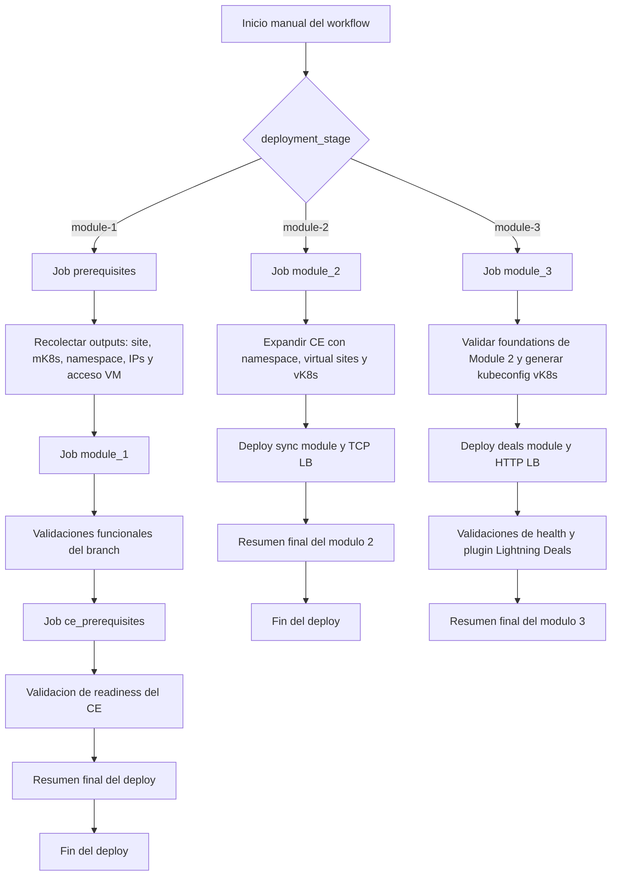

## Topologia de la arquitectura desplegada

La infraestructura creada por este workflow no es un unico bloque monolitico. Se construye por capas y cada etapa agrega recursos concretos sobre los ya existentes. El resultado final combina tres dominios de infraestructura: un branch en AWS con App Stack y mK8s, un CE site dedicado para cargas compartidas y un plano de exposicion en XC para publicar servicios internos y externos.

La topologia completa queda organizada asi:

- una capa de branch con VPC, subnet, App Stack site, mK8s, VM Windows y workloads de kiosk
- una capa de Customer Edge con VPC dedicada, CE site, virtual sites y vK8s para cargas online compartidas
- una capa de exposicion y service insertion en XC con origin pools, HTTP load balancers y TCP load balancers
- una capa de consumo donde WordPress y la VM del branch usan dominios internos para recomendaciones, sincronizacion y deals

### Resumen de componentes realmente desplegados

El resultado final del workflow es esta arquitectura funcional:

- una VPC de branch en AWS con una subnet principal para el nodo de App Stack y la VM Windows del kiosco
- un `aws_vpc_site` de F5 XC sobre esa VPC, asociado a un mK8s administrado por XC
- una VM Windows con IP publica para acceso RDP y pruebas funcionales desde la propia red del branch
- un namespace de aplicacion en mK8s con `mysql`, `wordpress` y `kiosk` como workloads separados
- un HTTP load balancer interno para el frontend del kiosco y otro HTTP load balancer interno para el servicio de recomendaciones
- un origin pool Kubernetes para `kiosk-service` y un origin pool por DNS publico para el backend externo de recomendaciones
- una VPC independiente para CE con subnets separadas para outside, inside y workload, mas su CE site operativo en XC
- un namespace online, virtual sites y un vK8s para hospedar los componentes compartidos de BuyTime Online
- un despliegue del modulo de sincronizacion sobre vK8s junto con su TCP load balancer para el acceso a inventario
- un despliegue del servicio de deals sobre vK8s junto con su HTTP load balancer publico para `deals.<user_domain>`
- la configuracion automatica de WordPress para consumir `recommendations`, `inventory-server` y `deals` sin ajustes manuales posteriores
- validaciones automatizadas de readiness, smoke tests de red y resumen operativo al final de cada etapa

### Distribucion de recursos por etapa

La evolucion de la infraestructura queda asi:

- `module-1`: branch VPC, subnet, App Stack site, mK8s, VM kiosk, namespace de branch, workloads kiosk y load balancers HTTP internos.
- `module-2`: CE VPC, CE site, namespace `buytime-online`, virtual sites, vK8s, modulo de sincronizacion y TCP load balancer.
- `module-3`: servicio `deals` sobre el vK8s ya existente, origin pool asociado y HTTP load balancer publico.

Con esa secuencia, cada etapa agrega una capa funcional nueva sin rehacer la base anterior: primero el branch, despues el plano CE y finalmente la publicacion de deals.

## Vista consolidada de la infraestructura

Esta vista resume los bloques que quedan activos cuando las tres etapas terminan correctamente.

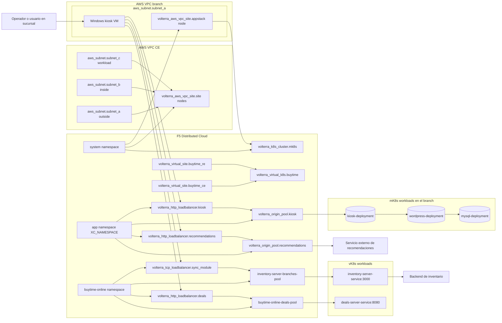

## Vista de direccionamiento IP, subnets y CIDR

La siguiente vista aterriza la topologia en terminos de direccionamiento. Para hacerla concreta, toma como referencia los valores tipicos del laboratorio y explicita las variables del workflow que gobiernan cada bloque:

- branch principal: `VPC_CIDR_MK8S = 10.125.0.0/16`
- subnet del branch: `cidrsubnet(VPC_CIDR_MK8S, 8, 10)` → `10.125.10.0/24`
- CE: `VPC_CIDR_CE = 172.24.0.0/16`
- subnet CE outside: `cidrsubnet(VPC_CIDR_CE, 8, 10)` → `172.24.10.0/24`
- subnet CE inside: `cidrsubnet(VPC_CIDR_CE, 8, 20)` → `172.24.20.0/24`
- subnet CE workload: `cidrsubnet(VPC_CIDR_CE, 8, 30)` → `172.24.30.0/24`

Las IP exactas del `App Stack site` y de la `Windows kiosk VM` no son fijas: el workflow las obtiene como outputs (`appstack_private_ip` y `kiosk_address`) despues del aprovisionamiento. El diagrama siguiente esta pensado como referencia operativa para troubleshooting y para correlacionar variables, subnets y endpoints.

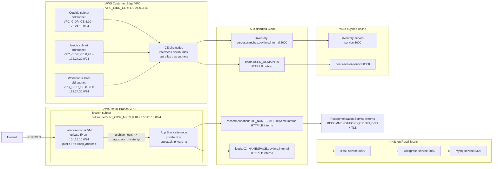

Si tambien se despliega la segunda sucursal con el workflow `deploy-aws-second-branch.yml`, el laboratorio deriva automaticamente este segundo bloque de direccionamiento:

- segundo namespace: `branch-b` si el principal es `branch-a`
- segunda VPC: `10.126.0.0/16`
- segunda subnet del branch: `10.126.10.0/24`
- segundo dominio interno kiosk: `kiosk.branch-b.buytime.internal`
- segundo dominio interno recommendations: `recommendations.branch-b.buytime.internal`

## Planos de la arquitectura

Para que la topologia sea mas clara, conviene separarla en cinco vistas: automatizacion, control, infraestructura AWS, workloads en mK8s y workloads en vK8s.

### 1. Plano de automatizacion

Este plano describe quien despliega y donde se guarda el estado.

- GitHub Actions coordina el orden de ejecucion
- Terraform Cloud guarda el estado remoto en workspaces separados
- el workflow se comunica con AWS y F5 XC usando credenciales del repositorio
- el job `prerequisites` publica outputs consumidos por `module_1`

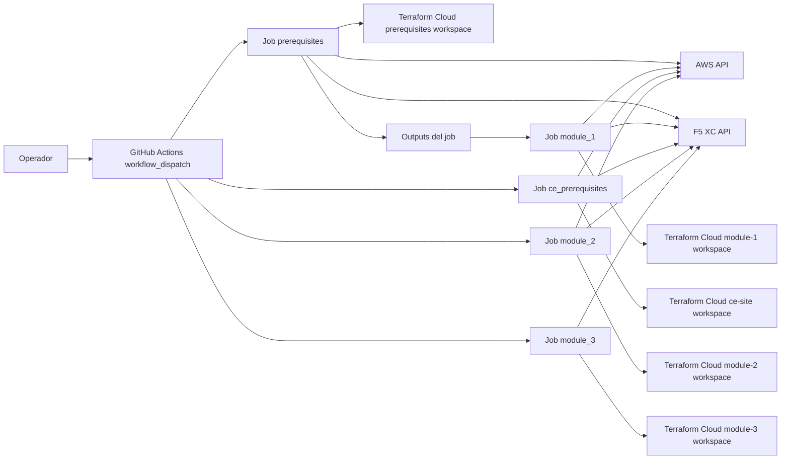

### 2. Plano de control

Este plano muestra como F5 XC controla tanto el branch como la capa online.

- el namespace `system` contiene el App Stack site, el CE site y el mK8s
- el namespace de aplicacion del branch contiene los objetos de exposicion de `module-1`
- el namespace `buytime-online` contiene virtual sites, vK8s, origin pools y load balancers de `module-2` y `module-3`
- el workflow genera credenciales temporales para obtener kubeconfig de mK8s y vK8s sin exponer credenciales persistentes del cluster

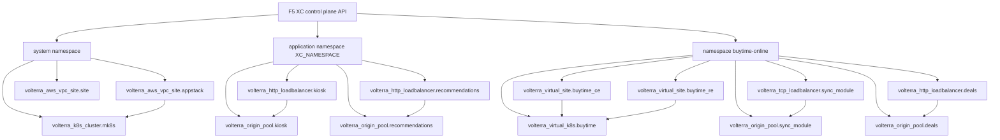

### 3. Plano de infraestructura en AWS

Este workflow materializa dos dominios de red separados en AWS: uno para el branch y otro para CE.

Recursos principales:

- `aws_vpc.vpc` del branch
- `aws_subnet.subnet_a` del branch
- `aws_instance.kiosk`
- `aws_security_group.kiosk_sg`
- `aws_key_pair.kiosk_key_pair`
- `aws_vpc.vpc` del CE
- `aws_subnet.subnet_a`, `aws_subnet.subnet_b` y `aws_subnet.subnet_c` del CE
- nodos del App Stack site y del CE site desplegados por XC

Características importantes:

- la VM kiosk tiene IP publica para RDP
- el App Stack site usa una sola interfaz y queda sin `internet VIP`
- tanto la VM como el nodo del sitio comparten la red privada del branch
- el CE site usa topologia de dos interfaces con redes separadas para outside, inside y workload
- el workflow consulta la interfaz de red del App Stack para descubrir su IP privada

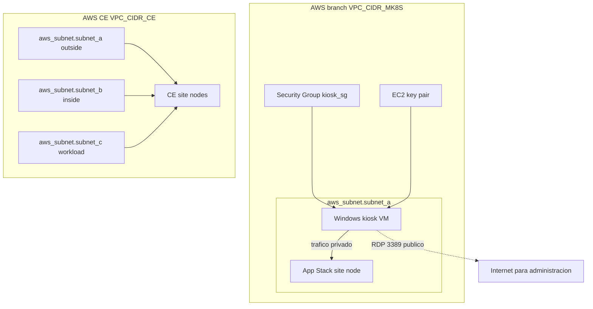

### 4. Plano de workloads en mK8s

Dentro del mK8s, el workflow implementa una aplicacion tipo branch kiosk basada en tres componentes.

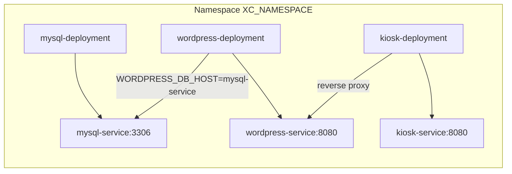

#### Funcion de cada componente

- `mysql-deployment`: base de datos para WordPress
- `wordpress-deployment`: aplicacion principal de BuyTime basada en WooCommerce
- `kiosk-deployment`: reverse proxy frontal que expone la experiencia kiosk
- `mysql-service`: servicio ClusterIP para la base de datos
- `wordpress-service`: servicio ClusterIP para la app WordPress
- `kiosk-service`: servicio ClusterIP consumido por el HTTP LB interno de XC

### 5. Plano de workloads en vK8s

Sobre el vK8s `buytime`, el workflow despliega dos servicios de apoyo para la experiencia online y la sincronizacion.

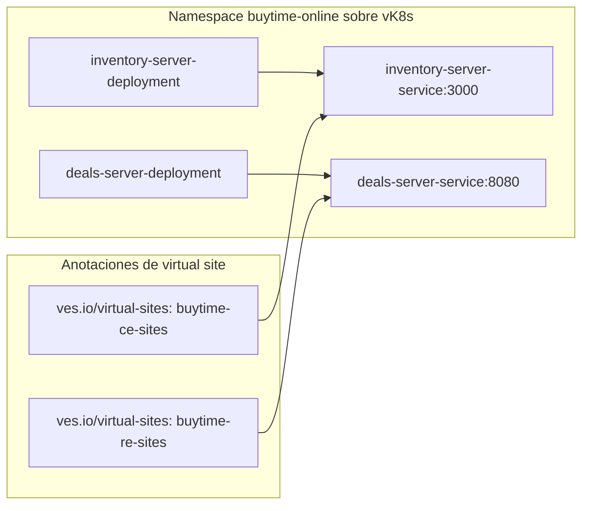

#### Funcion de los componentes online

- `inventory-server-deployment`: backend TCP para sincronizacion de inventario consumido desde el branch
- `inventory-server-service`: servicio ClusterIP anunciado en `buytime-ce-sites` y publicado por `volterra_tcp_loadbalancer.sync_module`
- `deals-server-deployment`: backend HTTP para promociones de Lightning Deals
- `deals-server-service`: servicio ClusterIP anunciado en `buytime-re-sites` y publicado por `volterra_http_loadbalancer.deals`

## Topologia de exposicion de servicios

La exposicion de la aplicacion se hace con dos HTTP load balancers internos en XC, ambos anunciados en el App Stack site.

### Dominio 1: kiosk

- dominio: `kiosk.<namespace>.buytime.internal`
- tipo: `volterra_http_loadbalancer`
- origen: `kiosk-service.<namespace>` sobre el sitio App Stack
- puerto de origen: `8080`

### Dominio 2: recommendations

- dominio: `recommendations.<namespace>.buytime.internal`
- tipo: `volterra_http_loadbalancer`
- origen: DNS publico externo configurado en el modulo
- puerto de origen: variable `recommendations_origin_port`
- TLS habilitado hacia el origen externo

### Vista detallada de exposicion

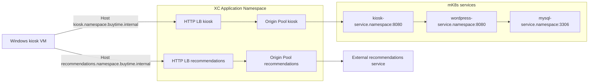

## Topologia DNS y resolucion de nombres

Este punto es importante porque es distinto de lo que a veces se asume al ver un load balancer en XC.

Lo que implementa el workflow es esto:

- crea dominios lógicos en los HTTP load balancers
- **no** crea DNS administrado por XC para esos dominios
- usa `dns_volterra_managed = false`
- resuelve el acceso desde la VM kiosk escribiendo entradas en `hosts`

Consecuencia directa:

- los nombres existen como hostnames configurados en el LB
- la resolucion local desde la VM depende del archivo `hosts`
- el trafico funciona por nombre dentro de la VM porque el `user_data` mapea ambos nombres a la IP privada del App Stack site

### Vista de resolucion local

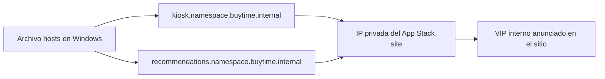

## Recorrido extremo a extremo del kiosco

Cuando el operador usa la aplicacion desde la VM Windows, el flujo real es este:

1. la VM resuelve `kiosk.<namespace>.buytime.internal` via `hosts`
2. la solicitud se dirige a la IP privada del App Stack site
3. XC recibe el trafico en el HTTP load balancer `kiosk`
4. el load balancer selecciona el origin pool del kiosco
5. el origin pool enruta a `kiosk-service.<namespace>`
6. el pod `kiosk` actua como proxy hacia WordPress
7. WordPress obtiene datos desde MySQL
8. la respuesta vuelve al navegador de la VM

Despues del deploy, el workflow tambien escribe en WordPress la configuracion del plugin BuyTime para que el frontend use automaticamente `recommendations.<namespace>.buytime.internal` sin intervencion manual en `wp-admin`.

Sobre `Store Mode` en `wp-admin`:

- `Buytime Kiosk` activa el flujo de sucursal o kiosk y prioriza `Recommendations` y `Synchronization`; este es el modo correcto para la VM Windows del branch.
- `Buytime Online Store` activa el flujo de tienda online y prioriza `Lightning Deals`; este modo hace que el frontend consuma `http://deals.<user_domain>/deals` y use `http://deals.<user_domain>/health` como comprobacion de salud.
- El selector no es cosmetico: define que experiencia principal muestra el plugin BuyTime en WordPress.

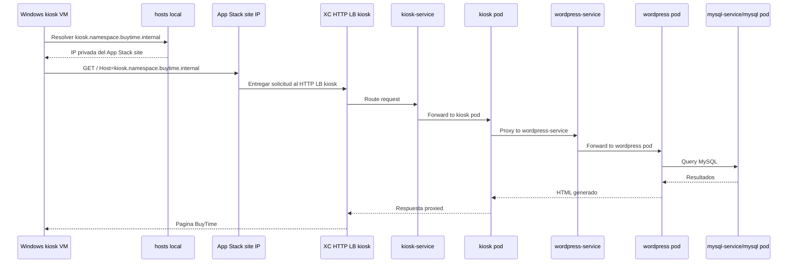

## Recorrido extremo a extremo del servicio de recomendaciones

El flujo de recomendaciones es distinto porque no termina dentro del mK8s del branch.

1. la VM o la aplicacion usa `recommendations.<namespace>.buytime.internal`
2. XC recibe la solicitud en el HTTP load balancer `recommendations`
3. ese load balancer usa un origin pool con `public_name`
4. el trafico sale hacia el servicio externo de recomendaciones por TLS

En la implementacion actual, WordPress ya queda preconfigurado para consumir este dominio interno de recomendaciones, por lo que la validacion manual en `wp-admin` deja de ser un requisito para cerrar Module 1.

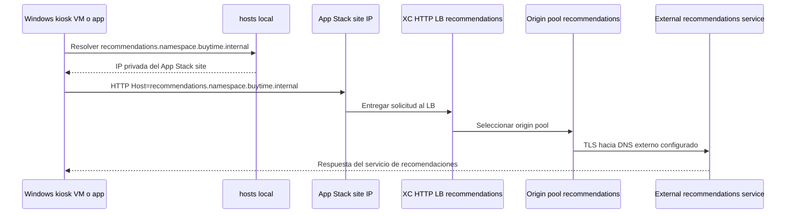

## Job prerequisites

Este job prepara la base del entorno y publica outputs que el segundo job necesita.

### Paso a paso

1. Hace checkout del repositorio.
2. Configura Terraform con el token de Terraform Cloud.
3. Valida que existan las variables obligatorias.
4. Valida que `VPC_CIDR_MK8S` sea un CIDR valido.
5. Calcula los nombres de workspaces remotos a partir de `PROJECT_PREFIX` y `XC_NAMESPACE`.
6. Decodifica el certificado P12 de XC en un archivo temporal.
7. Verifica que el certificado cliente de XC no este expirado.
8. Inicializa el modulo `namespace-probe`.
9. Detecta si el namespace XC ya existe o si debe crearse.
10. Inicializa el modulo `prerequisites` usando Terraform Cloud.
11. Ejecuta `terraform apply` sobre `aws-mk8s-vk8s/prerequisites`.
12. Extrae outputs del estado remoto para usarlos en `module_1`.

### Diagrama del job prerequisites

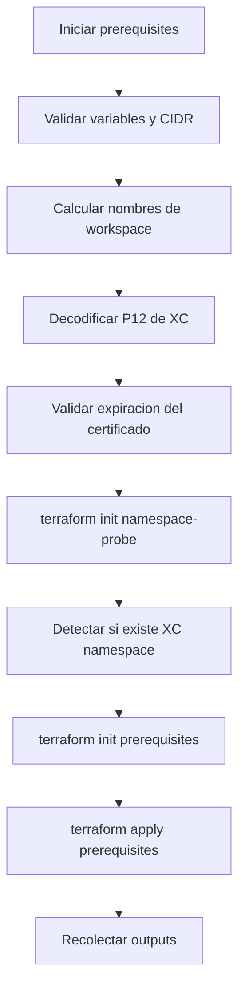

## Que crea prerequisites

El job `prerequisites` prepara la base del laboratorio. En terminos funcionales, deja listo lo siguiente:

- namespace XC, si aun no existe
- VPC y subnet en AWS
- App Stack site en XC sobre AWS
- mK8s del sitio, o reutiliza uno existente si se definio `EXISTING_MK8S_CLUSTER_NAME`
- VM Windows kiosk
- contraseña opcional de Windows mediante `PASSWORD_VM_WINDOWS`
- entradas del archivo `hosts` en la VM para `kiosk.<namespace>.buytime.internal` y `recommendations.<namespace>.buytime.internal`

## Job module_1

Este job depende de los outputs del job anterior y solo corre cuando `prerequisites` termina correctamente.

### Paso a paso

1. Hace checkout del repositorio.
2. Configura Terraform.
3. Configura `kubectl`.
4. Restaura el nombre del workspace de `module_1` usando el `workspace_prefix` generado en `prerequisites`.
5. Decodifica nuevamente el certificado P12 de XC.
6. Verifica que el certificado cliente de XC siga siendo valido.
7. Espera a que el App Stack site en XC entre en estado utilizable.
8. Inicializa el helper `kubeconfig`.
9. Crea una credencial temporal en XC y genera un kubeconfig del sitio.
10. Espera a que el API del mK8s responda correctamente.
11. Inicializa Terraform para `aws-mk8s-vk8s/module-1`.
12. Ejecuta `terraform apply` de `module_1`.
13. Si aparece el error transitorio `the server is currently unable to handle the request`, reintenta hasta 4 veces.
14. Extrae los dominios finales de `kiosk` y `recommendations` desde los outputs de Terraform.
15. Valida que los deployments y services del namespace esten disponibles y que `mysql`, `wordpress` y `kiosk` completen su rollout.
16. Configura automaticamente el plugin BuyTime de recomendaciones dentro del pod de WordPress.
17. Ejecuta un smoke test del kiosk a traves de `port-forward`, incluyendo validacion de `/` y `/wp-admin/`.
18. Verifica que el origen externo de recomendaciones responda por HTTPS.
19. Escribe un resumen final del deploy en `GITHUB_STEP_SUMMARY`.
20. Revoca la credencial temporal de kubeconfig al final, incluso si hubo error.

### Diagrama del job module_1

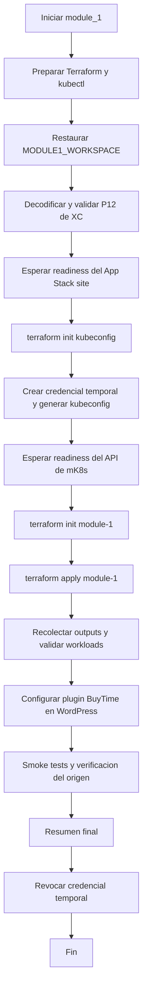

## Espera de readiness del App Stack site

Antes de aplicar `module_1`, el workflow consulta directamente la API de XC para confirmar que el sitio haya llegado a un estado adecuado.

Estados considerados listos:

- `ONLINE`
- `ORCHESTRATION_COMPLETE`
- `VALIDATION_SUCCESS`

Estados considerados terminales con error:

- `FAILED`
- `FAILED_INACTIVE`
- `ERROR_IN_ORCHESTRATION`
- `VALIDATION_FAILED`
- `ERROR_DELETING_CLOUD_RESOURCES`
- `ERROR_UPDATING_CLOUD_RESOURCES`

Esto evita intentar aplicar Kubernetes cuando el sitio aun no esta listo.

## Como obtiene acceso Kubernetes para aplicar module_1

El modulo `module_1` usa el provider `kubectl`, por lo que el workflow necesita un kubeconfig valido del sitio.

Para resolverlo, el job:

1. Usa el modulo `aws-mk8s-vk8s/kubeconfig`.
2. Intenta crear una credencial temporal con varios roles candidatos.
3. Si un rol no existe o esta deshabilitado, prueba el siguiente.
4. Si encuentra uno valido, genera un kubeconfig temporal.
5. Usa ese kubeconfig para validar el API de Kubernetes y luego hacer el apply de `module_1`.
6. Al final destruye la credencial temporal creada.

## Espera de readiness del mK8s API

Despues de obtener el kubeconfig, el workflow no asume que el cluster ya esta listo.

La verificacion de readiness hace dos pruebas:

- `kubectl cluster-info`
- `kubectl get namespace default -o name`

Solo cuando ambas funcionan se considera que el API ya esta usable para el provider `kubectl`.

## Reintentos en module_1

El deploy de `module_1` tiene manejo de errores transitorios del API de Kubernetes.

Si el log contiene el mensaje:

- `the server is currently unable to handle the request`

el workflow espera 30 segundos y vuelve a intentar, hasta un maximo de 4 intentos.

Esto reduce fallas intermitentes cuando el mK8s aun esta estabilizandose aunque ya responda.

### Diagrama del bloque de reintentos

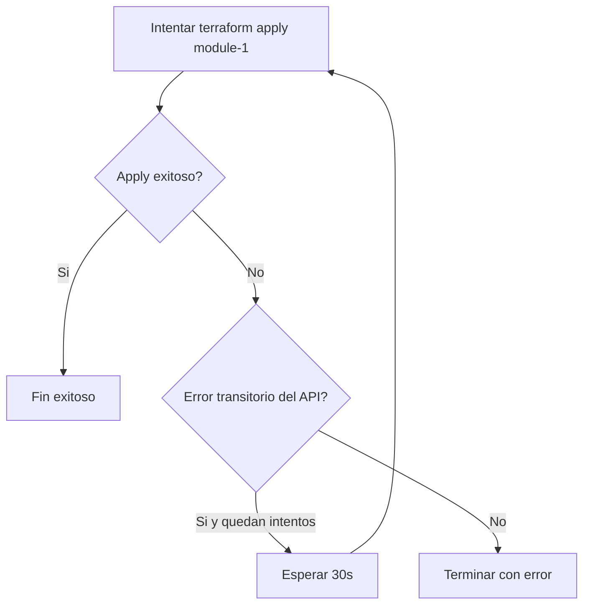

## Outputs que conectan ambos jobs

El job `prerequisites` publica estos outputs:

- `app_stack_name`
- `mk8s_cluster_name`
- `xc_namespace`
- `appstack_private_ip`
- `kiosk_address`
- `kiosk_user`
- `workspace_prefix`

El job `module_1` usa principalmente:

- `app_stack_name`
- `xc_namespace`
- `appstack_private_ip`
- `kiosk_address`
- `kiosk_user`
- `workspace_prefix`

## Consideraciones operativas

- El workflow usa Terraform Cloud workspaces calculados a partir de `PROJECT_PREFIX` y `XC_NAMESPACE`.
- Si `EXISTING_MK8S_CLUSTER_NAME` tiene valor, el deploy reutiliza un mK8s existente en lugar de crear uno nuevo.
- Si `PASSWORD_VM_WINDOWS` tiene valor valido, la VM kiosk fija esa contraseña en el primer arranque.
- La VM kiosk tambien escribe automaticamente el archivo `hosts` con los nombres internos del laboratorio.
- El workflow normaliza `RECOMMENDATIONS_ORIGIN_DNS` y `RECOMMENDATIONS_ORIGIN_PORT` para que Terraform y las validaciones usen exactamente el mismo origen efectivo.
- El workflow configura automaticamente el plugin BuyTime de WordPress con el dominio `recommendations.<namespace>.buytime.internal`.
- Para pruebas sobre la VM Windows se debe mantener `Store Mode = Buytime Kiosk`; si se quiere validar `Lightning Deals`, hay que cambiar el sitio a `Store Mode = Buytime Online Store` o usar una instancia separada para el flujo online.
- El deploy ya no depende de entrar manualmente a `wp-admin` para enlazar recomendaciones.
- El job finaliza con validaciones de workloads, smoke tests HTTP y un resumen legible en GitHub Actions.
- La credencial temporal usada para kubeconfig se revoca al final para no dejar acceso sobrante en XC.

## Resumen rapido

- `prerequisites` crea la base del entorno y publica outputs
- `module_1` espera readiness del sitio y del mK8s antes de aplicar
- el kubeconfig del sitio se genera de forma temporal
- el apply de `module_1` tiene reintentos para errores transitorios del API
- despues del apply, el workflow valida el estado de Kubernetes, configura automaticamente WordPress para usar `recommendations` y ejecuta smoke tests
- el resumen final del job deja visibles dominios, IPs y comprobaciones realizadas
- la credencial temporal se revoca siempre al terminar
