# Descripcion del Workflow de Deploy

Este documento describe el workflow [.github/workflows/deploy-aws-module-1.yml](.github/workflows/deploy-aws-module-1.yml), cuyo objetivo es desplegar la base de infraestructura en AWS y F5 Distributed Cloud, despues publicar el contenido de `module_1` sobre el mK8s del sitio y finalmente dejar creado el AWS CE site que servira como base para el futuro Module 2.

Ademas del aprovisionamiento, la version actual del workflow tambien valida el estado final del branch, configura automaticamente el plugin BuyTime de recomendaciones en WordPress, crea el CE site en un job separado sin adelantar virtual sites ni vK8s de Module 2, espera a que ese CE site quede operativo y deja un resumen operativo al finalizar.

Las dependencias consumidas por el workflow se estan consolidando bajo `aws-mk8s-vk8s/`. En particular, el stack de CE usado por el job `ce_prerequisites` ya se ejecuta desde `aws-mk8s-vk8s/aws-ce-site`.

## Nombre del workflow

`Deploy AWS Staged Modules`

## Como se ejecuta

El workflow se ejecuta manualmente mediante `workflow_dispatch`.

Recibe un input manual llamado `deployment_stage`, con estas opciones:

- `module-1`
- `module-2`
- `module-3`

Actualmente estan implementadas las etapas `module-1` y `module-2`. Si se selecciona `module-3`, el workflow falla rapido con un mensaje explicito para evitar ejecuciones ambiguas o falsas validaciones. Toda la configuracion de infraestructura sigue saliendo de variables y secretos del repositorio.

## Que hace en terminos generales

Cuando se selecciona `module-1`, el deploy se divide en tres jobs secuenciales:

1. `prerequisites`
   Crea o reutiliza la base necesaria para el entorno: namespace XC, VPC, subnet, App Stack site, mK8s y VM kiosk.

2. `module_1`
    Espera a que el sitio y el API de mK8s esten listos, genera un kubeconfig temporal, aplica el contenido de `module_1` y valida que el resultado final quede operativo.

3. `ce_prerequisites`
    Aplica el stack de AWS CE site en un job separado, usando un CIDR dedicado y un nombre explicito para el sitio CE, deja fuera los virtual sites y el vK8s que pertenecen al Module 2, y espera a que el site CE alcance un estado operativo en XC.

Cuando se selecciona `module-2`, el workflow reutiliza el workspace remoto de `prerequisites` para recuperar el `app_stack_name`, amplia el stack de CE en `aws-mk8s-vk8s/aws-ce-site` solo para los foundations de Module 2, reutiliza la cloud credential ya existente del CE en lugar de recrearla, evita reprovisionar la VPC y el site CE, intenta importar el namespace `buytime-online` al state remoto si ya existe y luego crea virtual sites, vK8s y kubeconfig. Despues espera a que el API del vK8s quede operativo y aplica `aws-mk8s-vk8s/module-2` para desplegar el modulo de sincronizacion y su TCP load balancer. Ademas, genera un kubeconfig temporal del branch, ejecuta una validacion TCP real desde el entorno del sitio hacia `inventory-server.branches.buytime.internal:3000` y valida el plugin de sincronizacion de WordPress usando la misma opcion y la misma comprobacion `ping`/`pong` que usa la interfaz del README.

Cuando se selecciona `module-3`, el workflow no intenta reutilizar jobs incompletos. En su lugar, corta la ejecucion en un job de validacion de etapa hasta que esa fase quede implementada en el mismo archivo.

## Variables y secretos relevantes

Variables de repositorio usadas por el workflow:

- `AWS_REGION`
- `PROJECT_PREFIX`
- `VPC_CIDR_MK8S`
- `VPC_CIDR_CE`
- `XC_NAMESPACE`
- `XC_SERVICE_CREDENTIAL_ROLE`
- `CE_SITE_NAME`
- `EXISTING_MK8S_CLUSTER_NAME`
- `PASSWORD_VM_WINDOWS`

Secrets usados por el workflow:

- `TF_API_TOKEN`
- `TF_CLOUD_ORGANIZATION`
- `XC_API_URL`
- `XC_API_P12_FILE`
- `XC_P12_PASSWORD`
- `AWS_ACCESS_KEY`
- `AWS_SECRET_KEY`

## Flujo General

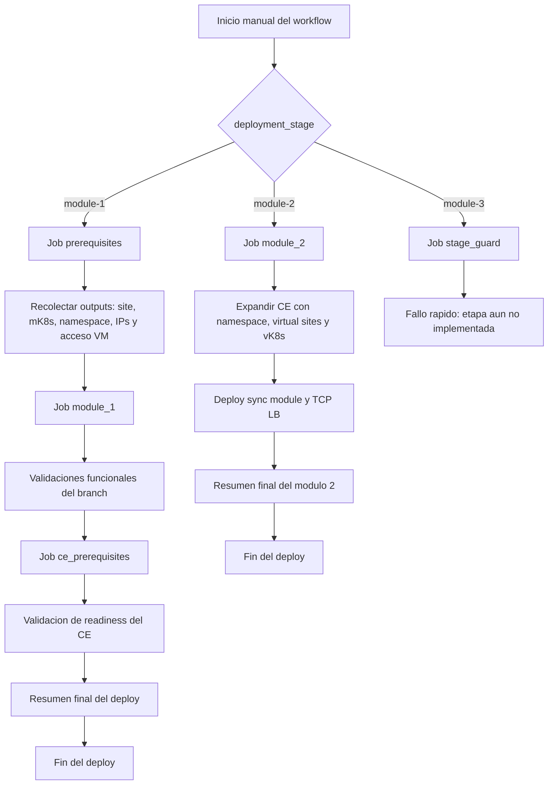

## Topologia de la arquitectura desplegada

La referencia original de `f5devcentral/xcawsedgedemoguide` presenta una arquitectura completa de BuyTime distribuida entre Retail Branch, Customer Edge y Regional Edge. Este workflow implementa solo una porcion de ese escenario: la parte de **Retail Branch sobre App Stack en AWS**, junto con la integracion hacia un servicio externo de recomendaciones.

Dicho de otra forma:

- la guia original muestra un escenario multisitio y multicloud mas amplio
- este workflow automatiza el tramo **Pre-Requisites + Module 1**, y ademas crea el AWS CE site como base de red para el siguiente modulo
- no despliega virtual sites de CE, vK8s, sincronizacion de inventario ni Regional Edge
- si deja operativa la sucursal o branch con App Stack, mK8s, kiosk VM, los HTTP load balancers internos de `kiosk` y `recommendations`, y WordPress configurado para usar el servicio de recomendaciones

### Alcance arquitectonico implementado por este workflow

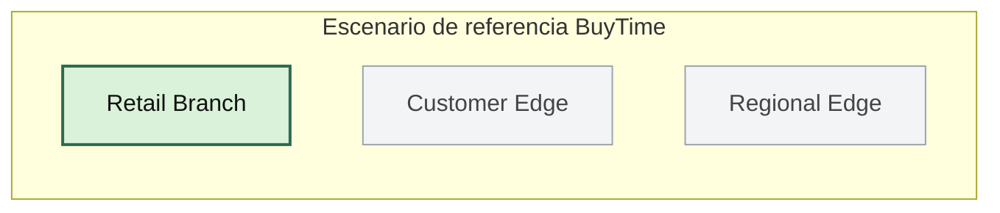

### Resumen de componentes realmente desplegados

El resultado final del workflow es esta arquitectura funcional:

- una VPC en AWS para el branch
- una subnet principal donde viven el App Stack site y la VM kiosk
- un `aws_vpc_site` de F5 XC sobre esa VPC
- un mK8s administrado por XC, creado o reutilizado
- una VM Windows kiosk con acceso RDP por IP publica
- un namespace de aplicacion en mK8s
- tres workloads Kubernetes para la experiencia de retail kiosk
- un HTTP load balancer interno para el frontend kiosk
- un HTTP load balancer interno para el servicio de recomendaciones
- un origin pool Kubernetes para el kiosco
- un origin pool por DNS publico para recomendaciones externas
- la configuracion del plugin BuyTime dentro de WordPress para apuntar al dominio interno de `recommendations`
- validaciones automatizadas de readiness, smoke tests y resumen final del despliegue
- un AWS CE site independiente, con su propia VPC y subnets, listo para ser reutilizado por Module 2
- una validacion explicita de que el CE site termine en estado operativo antes de cerrar el workflow

## Vista de escenario tipo guia, ajustada al workflow real

Esta vista intenta parecerse mas a la narrativa del repo de referencia, pero mostrando solo lo que este workflow materializa.

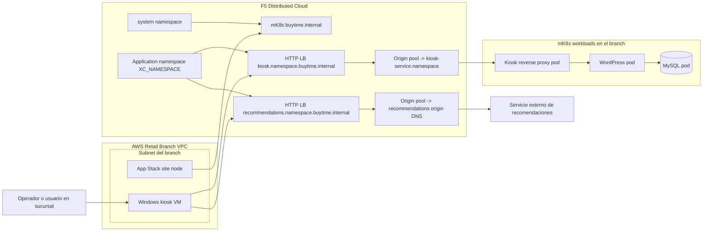

## Planos de la arquitectura

Para que la topologia sea mas clara, conviene separarla en cuatro planos: automatizacion, control, infraestructura y datos o trafico.

### 1. Plano de automatizacion

Este plano describe quien despliega y donde se guarda el estado.

- GitHub Actions coordina el orden de ejecucion
- Terraform Cloud guarda el estado remoto en workspaces separados
- el workflow se comunica con AWS y F5 XC usando credenciales del repositorio
- el job `prerequisites` publica outputs consumidos por `module_1`

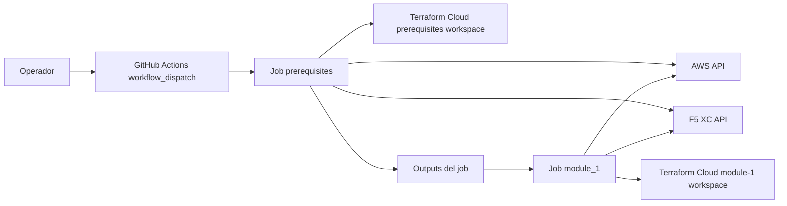

### 2. Plano de control

Este plano muestra como F5 XC controla la infraestructura del branch.

- el namespace `system` de XC contiene el `aws_vpc_site` y el mK8s
- el namespace de aplicacion contiene los objetos de exposicion de `module_1`
- el sitio App Stack se enlaza al mK8s asociado
- el workflow genera una credencial temporal para obtener kubeconfig del sitio

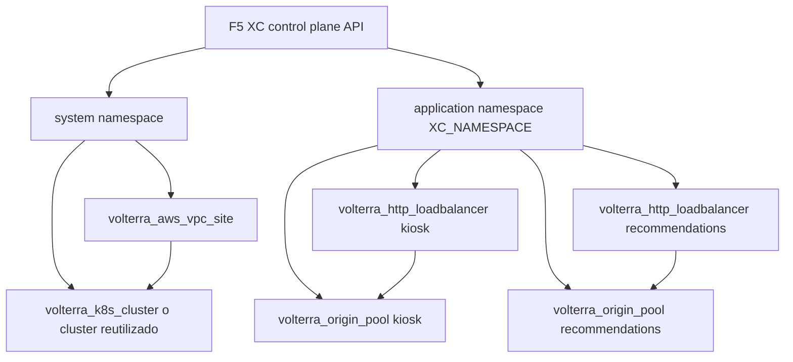

### 3. Plano de infraestructura en AWS

Este workflow materializa un branch sencillo en una sola VPC y una sola subnet.

Recursos principales:

- `aws_vpc`
- `aws_subnet`
- `aws_instance.kiosk`
- `aws_security_group.kiosk_sg`
- `aws_key_pair.kiosk_key_pair`
- nodo del App Stack site desplegado por XC dentro de la misma subnet

Características importantes:

- la VM kiosk tiene IP publica para RDP
- el App Stack site usa una sola interfaz y queda sin `internet VIP`
- tanto la VM como el nodo del sitio comparten la red privada del branch
- el workflow consulta la interfaz de red del App Stack para descubrir su IP privada

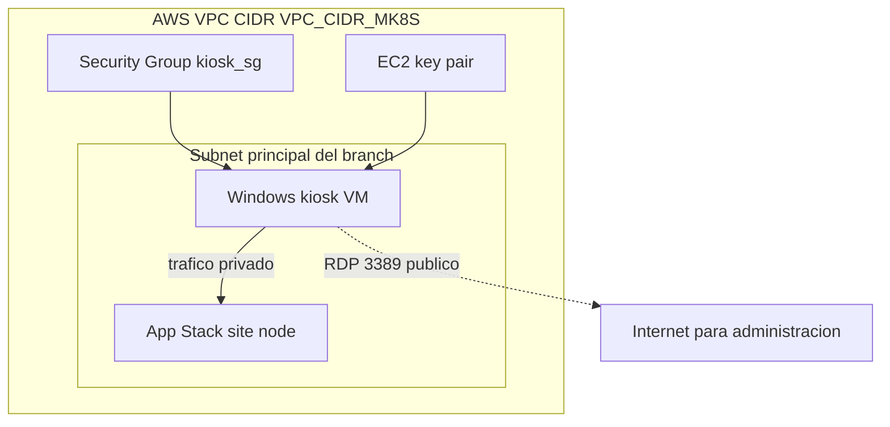

### 4. Plano de workloads en mK8s

Dentro del mK8s, el workflow implementa una aplicacion tipo branch kiosk basada en tres componentes.

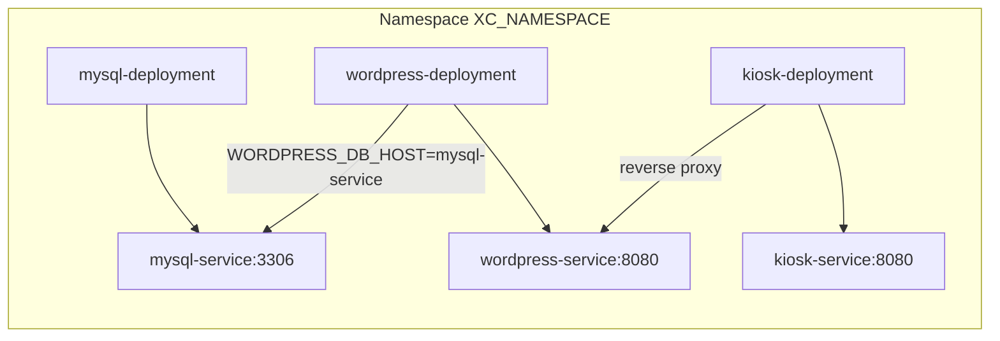

#### Funcion de cada componente

- `mysql-deployment`: base de datos para WordPress
- `wordpress-deployment`: aplicacion principal de BuyTime basada en WooCommerce
- `kiosk-deployment`: reverse proxy frontal que expone la experiencia kiosk
- `mysql-service`: servicio ClusterIP para la base de datos
- `wordpress-service`: servicio ClusterIP para la app WordPress
- `kiosk-service`: servicio ClusterIP consumido por el HTTP LB interno de XC

## Topologia de exposicion de servicios

La exposicion de la aplicacion se hace con dos HTTP load balancers internos en XC, ambos anunciados en el App Stack site.

### Dominio 1: kiosk

- dominio: `kiosk.<namespace>.buytime.internal`
- tipo: `volterra_http_loadbalancer`
- origen: `kiosk-service.<namespace>` sobre el sitio App Stack
- puerto de origen: `8080`

### Dominio 2: recommendations

- dominio: `recommendations.<namespace>.buytime.internal`
- tipo: `volterra_http_loadbalancer`
- origen: DNS publico externo configurado en el modulo
- puerto de origen: variable `recommendations_origin_port`
- TLS habilitado hacia el origen externo

### Vista detallada de exposicion

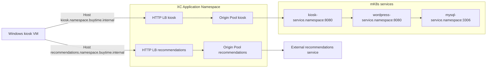

## Topologia DNS y resolucion de nombres

Este punto es importante porque es distinto de lo que a veces se asume al ver un load balancer en XC.

Lo que implementa el workflow es esto:

- crea dominios lógicos en los HTTP load balancers
- **no** crea DNS administrado por XC para esos dominios
- usa `dns_volterra_managed = false`
- resuelve el acceso desde la VM kiosk escribiendo entradas en `hosts`

Consecuencia directa:

- los nombres existen como hostnames configurados en el LB
- la resolucion local desde la VM depende del archivo `hosts`
- el trafico funciona por nombre dentro de la VM porque el `user_data` mapea ambos nombres a la IP privada del App Stack site

### Vista de resolucion local

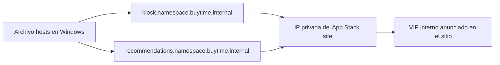

## Recorrido extremo a extremo del kiosco

Cuando el operador usa la aplicacion desde la VM Windows, el flujo real es este:

1. la VM resuelve `kiosk.<namespace>.buytime.internal` via `hosts`
2. la solicitud se dirige a la IP privada del App Stack site
3. XC recibe el trafico en el HTTP load balancer `kiosk`
4. el load balancer selecciona el origin pool del kiosco
5. el origin pool enruta a `kiosk-service.<namespace>`
6. el pod `kiosk` actua como proxy hacia WordPress
7. WordPress obtiene datos desde MySQL
8. la respuesta vuelve al navegador de la VM

Despues del deploy, el workflow tambien escribe en WordPress la configuracion del plugin BuyTime para que el frontend use automaticamente `recommendations.<namespace>.buytime.internal` sin intervencion manual en `wp-admin`.

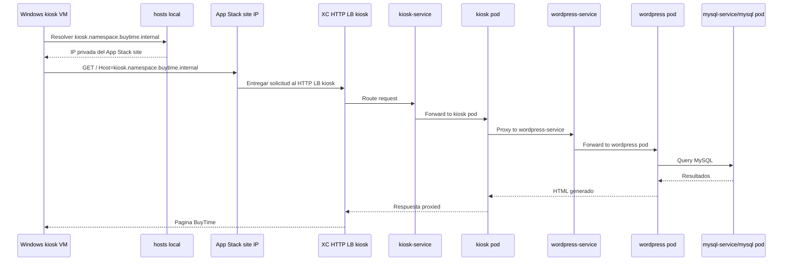

## Recorrido extremo a extremo del servicio de recomendaciones

El flujo de recomendaciones es distinto porque no termina dentro del mK8s del branch.

1. la VM o la aplicacion usa `recommendations.<namespace>.buytime.internal`
2. XC recibe la solicitud en el HTTP load balancer `recommendations`
3. ese load balancer usa un origin pool con `public_name`
4. el trafico sale hacia el servicio externo de recomendaciones por TLS

En la implementacion actual, WordPress ya queda preconfigurado para consumir este dominio interno de recomendaciones, por lo que la validacion manual en `wp-admin` deja de ser un requisito para cerrar Module 1.

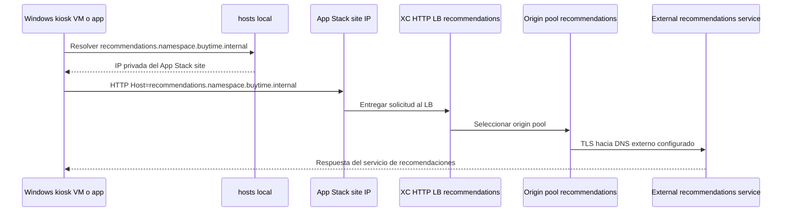

## Mapa de correspondencia con la guia de referencia

Para evitar confusion, esta es la equivalencia entre la narrativa del repo original y lo que este workflow automatiza realmente.

- `Create mK8s resource`: si, lo crea o reutiliza
- `Create app stack`: si, lo crea
- `Get mK8s Kubeconfig`: si, lo genera de forma temporal durante el workflow
- `Create AWS CE site`: no, este workflow no lo implementa
- `Deploy kiosk`: si, mediante `module_1`
- `Create branch namespace`: si, lo crea o reutiliza desde Terraform y Kubernetes
- `Create HTTP LB for kiosk`: si
- `HTTP LB recommendations module`: si
- `Test recommendations module`: si, en gran parte; el workflow configura automaticamente el plugin y valida la salud tecnica, aunque la comprobacion visual final en la UI sigue siendo opcional
- `Module 2`: no
- `Module 3`: no

## Conclusiones de topologia

La arquitectura que implementa este workflow es la de una **Retail Branch App Stack deployment** con estas propiedades clave:

- una sola sucursal en AWS
- un solo App Stack site
- un solo mK8s asociado al branch
- una VM de prueba dentro de la misma red del branch
- una aplicacion 3-tier en mK8s para el kiosco
- exposicion interna por HTTP LB de XC
- extension funcional hacia un servicio externo de recomendaciones

Eso la convierte en una automatizacion fiel al tramo inicial del escenario BuyTime, pero todavia acotada al branch y no al resto del diseño multicloud completo de la guia original.

## Job prerequisites

Este job prepara la base del entorno y publica outputs que el segundo job necesita.

### Paso a paso

1. Hace checkout del repositorio.
2. Configura Terraform con el token de Terraform Cloud.
3. Valida que existan las variables obligatorias.
4. Valida que `VPC_CIDR_MK8S` sea un CIDR valido.
5. Calcula los nombres de workspaces remotos a partir de `PROJECT_PREFIX` y `XC_NAMESPACE`.
6. Decodifica el certificado P12 de XC en un archivo temporal.
7. Verifica que el certificado cliente de XC no este expirado.
8. Inicializa el modulo `namespace-probe`.
9. Detecta si el namespace XC ya existe o si debe crearse.
10. Inicializa el modulo `prerequisites` usando Terraform Cloud.
11. Ejecuta `terraform apply` sobre `aws-mk8s-vk8s/prerequisites`.
12. Extrae outputs del estado remoto para usarlos en `module_1`.

### Diagrama del job prerequisites

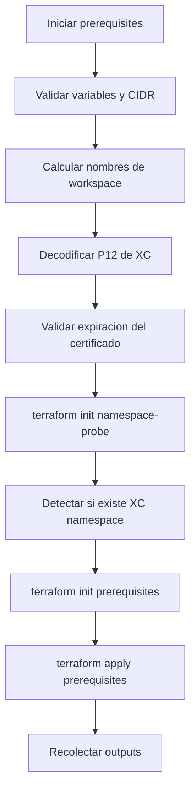

## Que crea prerequisites

El job `prerequisites` prepara la base del laboratorio. En terminos funcionales, deja listo lo siguiente:

- namespace XC, si aun no existe
- VPC y subnet en AWS
- App Stack site en XC sobre AWS
- mK8s del sitio, o reutiliza uno existente si se definio `EXISTING_MK8S_CLUSTER_NAME`
- VM Windows kiosk
- contraseña opcional de Windows mediante `PASSWORD_VM_WINDOWS`
- entradas del archivo `hosts` en la VM para `kiosk.<namespace>.buytime.internal` y `recommendations.<namespace>.buytime.internal`

## Job module_1

Este job depende de los outputs del job anterior y solo corre cuando `prerequisites` termina correctamente.

### Paso a paso

1. Hace checkout del repositorio.
2. Configura Terraform.
3. Configura `kubectl`.
4. Restaura el nombre del workspace de `module_1` usando el `workspace_prefix` generado en `prerequisites`.
5. Decodifica nuevamente el certificado P12 de XC.
6. Verifica que el certificado cliente de XC siga siendo valido.
7. Espera a que el App Stack site en XC entre en estado utilizable.
8. Inicializa el helper `kubeconfig`.
9. Crea una credencial temporal en XC y genera un kubeconfig del sitio.
10. Espera a que el API del mK8s responda correctamente.
11. Inicializa Terraform para `aws-mk8s-vk8s/module-1`.
12. Ejecuta `terraform apply` de `module_1`.
13. Si aparece el error transitorio `the server is currently unable to handle the request`, reintenta hasta 4 veces.
14. Extrae los dominios finales de `kiosk` y `recommendations` desde los outputs de Terraform.
15. Valida que los deployments y services del namespace esten disponibles y que `mysql`, `wordpress` y `kiosk` completen su rollout.
16. Configura automaticamente el plugin BuyTime de recomendaciones dentro del pod de WordPress.
17. Ejecuta un smoke test del kiosk a traves de `port-forward`, incluyendo validacion de `/` y `/wp-admin/`.
18. Verifica que el origen externo de recomendaciones responda por HTTPS.
19. Escribe un resumen final del deploy en `GITHUB_STEP_SUMMARY`.
20. Revoca la credencial temporal de kubeconfig al final, incluso si hubo error.

### Diagrama del job module_1

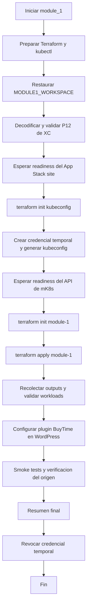

## Espera de readiness del App Stack site

Antes de aplicar `module_1`, el workflow consulta directamente la API de XC para confirmar que el sitio haya llegado a un estado adecuado.

Estados considerados listos:

- `ONLINE`
- `ORCHESTRATION_COMPLETE`
- `VALIDATION_SUCCESS`

Estados considerados terminales con error:

- `FAILED`
- `FAILED_INACTIVE`
- `ERROR_IN_ORCHESTRATION`
- `VALIDATION_FAILED`
- `ERROR_DELETING_CLOUD_RESOURCES`
- `ERROR_UPDATING_CLOUD_RESOURCES`

Esto evita intentar aplicar Kubernetes cuando el sitio aun no esta listo.

## Como obtiene acceso Kubernetes para aplicar module_1

El modulo `module_1` usa el provider `kubectl`, por lo que el workflow necesita un kubeconfig valido del sitio.

Para resolverlo, el job:

1. Usa el modulo `aws-mk8s-vk8s/kubeconfig`.
2. Intenta crear una credencial temporal con varios roles candidatos.
3. Si un rol no existe o esta deshabilitado, prueba el siguiente.
4. Si encuentra uno valido, genera un kubeconfig temporal.
5. Usa ese kubeconfig para validar el API de Kubernetes y luego hacer el apply de `module_1`.
6. Al final destruye la credencial temporal creada.

## Espera de readiness del mK8s API

Despues de obtener el kubeconfig, el workflow no asume que el cluster ya esta listo.

La verificacion de readiness hace dos pruebas:

- `kubectl cluster-info`
- `kubectl get namespace default -o name`

Solo cuando ambas funcionan se considera que el API ya esta usable para el provider `kubectl`.

## Reintentos en module_1

El deploy de `module_1` tiene manejo de errores transitorios del API de Kubernetes.

Si el log contiene el mensaje:

- `the server is currently unable to handle the request`

el workflow espera 30 segundos y vuelve a intentar, hasta un maximo de 4 intentos.

Esto reduce fallas intermitentes cuando el mK8s aun esta estabilizandose aunque ya responda.

### Diagrama del bloque de reintentos

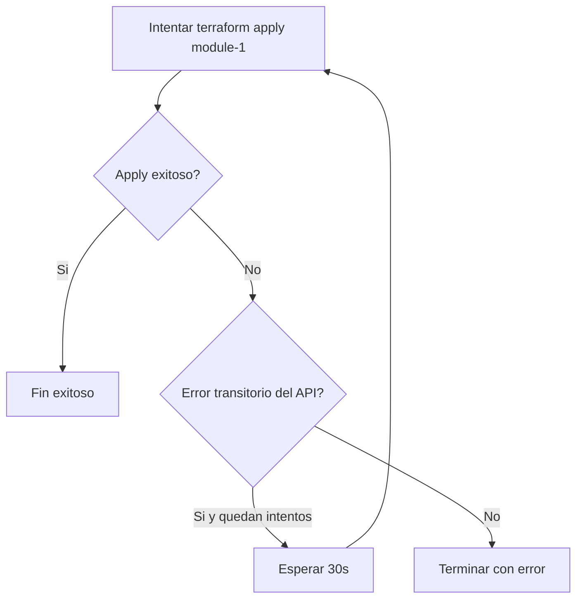

## Outputs que conectan ambos jobs

El job `prerequisites` publica estos outputs:

- `app_stack_name`
- `mk8s_cluster_name`
- `xc_namespace`
- `appstack_private_ip`
- `kiosk_address`
- `kiosk_user`
- `workspace_prefix`

El job `module_1` usa principalmente:

- `app_stack_name`
- `xc_namespace`
- `appstack_private_ip`
- `kiosk_address`
- `kiosk_user`
- `workspace_prefix`

## Consideraciones operativas

- El workflow usa Terraform Cloud workspaces calculados a partir de `PROJECT_PREFIX` y `XC_NAMESPACE`.
- Si `EXISTING_MK8S_CLUSTER_NAME` tiene valor, el deploy reutiliza un mK8s existente en lugar de crear uno nuevo.
- Si `PASSWORD_VM_WINDOWS` tiene valor valido, la VM kiosk fija esa contraseña en el primer arranque.
- La VM kiosk tambien escribe automaticamente el archivo `hosts` con los nombres internos del laboratorio.
- El workflow normaliza `RECOMMENDATIONS_ORIGIN_DNS` y `RECOMMENDATIONS_ORIGIN_PORT` para que Terraform y las validaciones usen exactamente el mismo origen efectivo.
- El workflow configura automaticamente el plugin BuyTime de WordPress con el dominio `recommendations.<namespace>.buytime.internal`.
- El deploy ya no depende de entrar manualmente a `wp-admin` para enlazar recomendaciones.
- El job finaliza con validaciones de workloads, smoke tests HTTP y un resumen legible en GitHub Actions.
- La credencial temporal usada para kubeconfig se revoca al final para no dejar acceso sobrante en XC.

## Resumen rapido

- `prerequisites` crea la base del entorno y publica outputs
- `module_1` espera readiness del sitio y del mK8s antes de aplicar
- el kubeconfig del sitio se genera de forma temporal
- el apply de `module_1` tiene reintentos para errores transitorios del API
- despues del apply, el workflow valida el estado de Kubernetes, configura automaticamente WordPress para usar `recommendations` y ejecuta smoke tests
- el resumen final del job deja visibles dominios, IPs y comprobaciones realizadas
- la credencial temporal se revoca siempre al terminar
