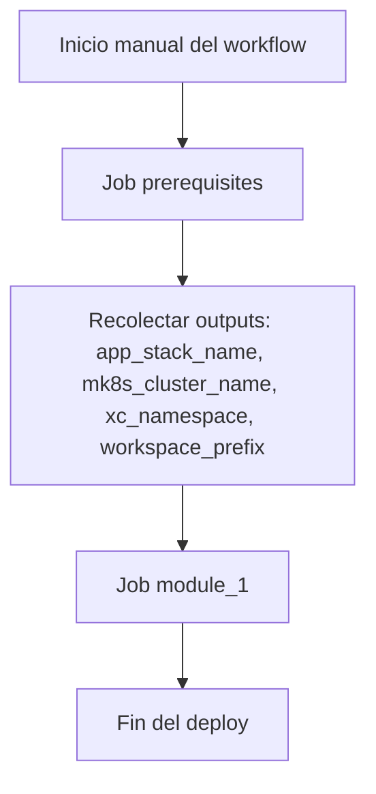
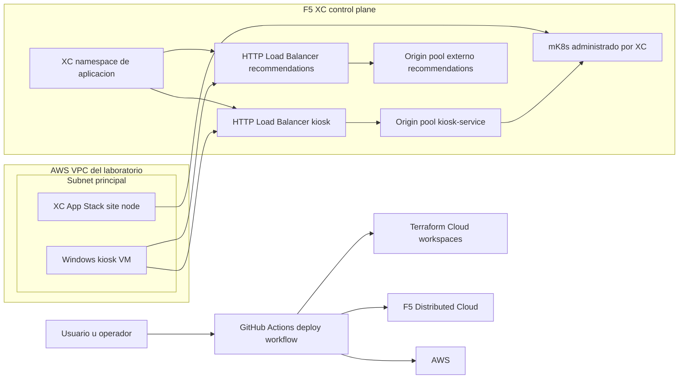
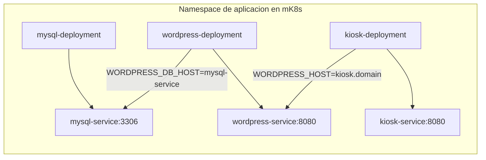
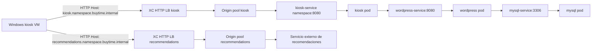
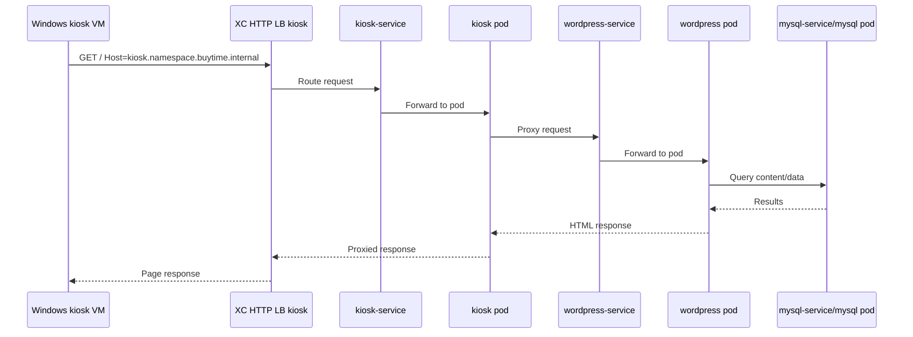
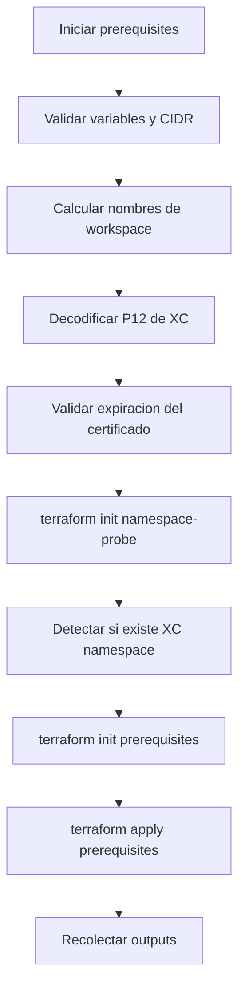
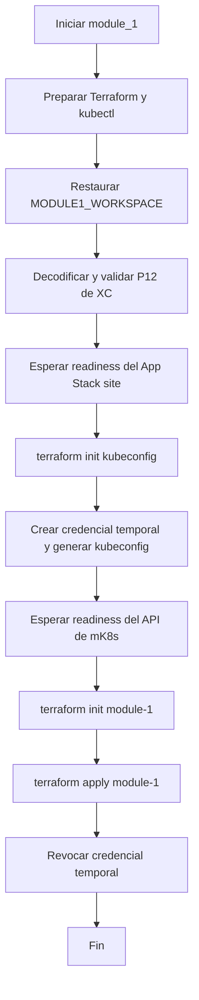
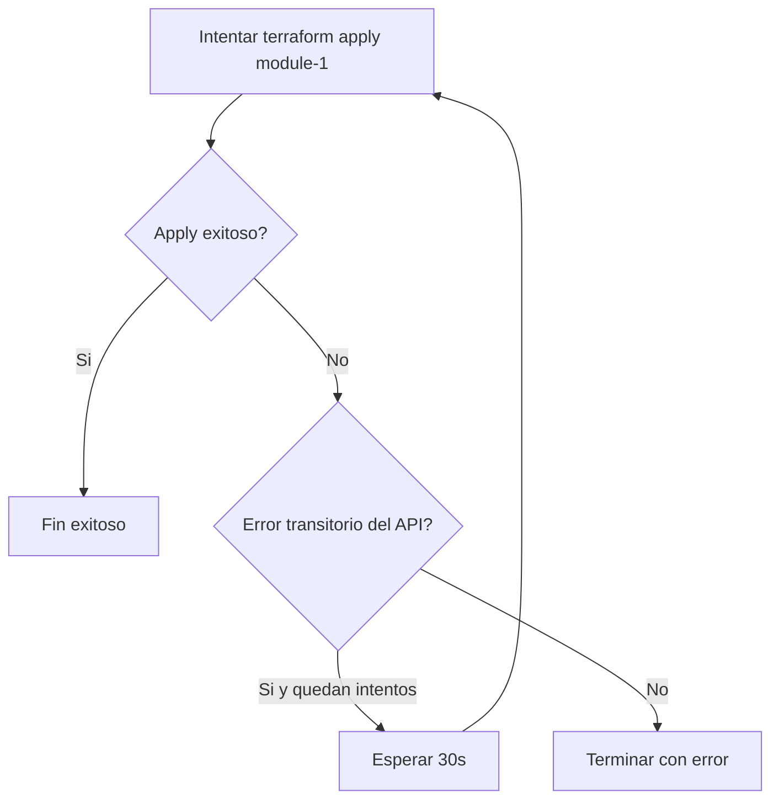

# Descripcion del Workflow de Deploy

Este documento describe el workflow [.github/workflows/deploy-aws-module-1.yml](.github/workflows/deploy-aws-module-1.yml), cuyo objetivo es desplegar la base de infraestructura en AWS y F5 Distributed Cloud, y despues publicar el contenido de `module_1` sobre el mK8s del sitio.

## Nombre del workflow

`Deploy AWS Prerequisites And Module 1`

## Como se ejecuta

El workflow se ejecuta manualmente mediante `workflow_dispatch`.

No recibe parametros de entrada en la invocacion. Toda la configuracion se toma desde variables y secretos del repositorio.

## Que hace en terminos generales

El deploy se divide en dos jobs secuenciales:

1. `prerequisites`
   Crea o reutiliza la base necesaria para el entorno: namespace XC, VPC, subnet, App Stack site, mK8s y VM kiosk.

2. `module_1`
   Espera a que el sitio y el API de mK8s esten listos, genera un kubeconfig temporal y luego aplica el contenido de `module_1`.

## Variables y secretos relevantes

Variables de repositorio usadas por el workflow:

- `AWS_REGION`
- `PROJECT_PREFIX`
- `VPC_CIDR_MK8S`
- `XC_NAMESPACE`
- `XC_SERVICE_CREDENTIAL_ROLE`
- `EXISTING_MK8S_CLUSTER_NAME`
- `PASSWORD_VM_WINDOWS`

Secrets usados por el workflow:

- `TF_API_TOKEN`
- `TF_CLOUD_ORGANIZATION`
- `XC_API_URL`
- `XC_API_P12_FILE`
- `XC_P12_PASSWORD`
- `AWS_ACCESS_KEY`
- `AWS_SECRET_KEY`

## Flujo General

## Topologia de la arquitectura desplegada

El workflow no solo ejecuta Terraform en dos etapas; en conjunto construye una arquitectura distribuida entre AWS y F5 Distributed Cloud.

En terminos practicos, la topologia final queda compuesta por estas capas:

- una VPC en AWS para el laboratorio
- una subnet donde viven el App Stack site y la VM kiosk
- un sitio XC tipo `aws_vpc_site` asociado a esa VPC
- un cluster mK8s administrado por XC, creado o reutilizado
- una VM Windows kiosk con IP publica para acceso RDP
- un namespace de aplicacion en mK8s
- tres workloads Kubernetes: `mysql`, `wordpress` y `kiosk`
- dos HTTP load balancers internos de XC
- dos dominios internos: `kiosk.<namespace>.buytime.internal` y `recommendations.<namespace>.buytime.internal`

### Vista topologica general

### Capas de la arquitectura

#### 1. Capa de automatizacion

La ejecucion empieza en GitHub Actions y usa Terraform Cloud como backend remoto.

- GitHub Actions orquesta el orden de despliegue
- Terraform Cloud conserva el estado remoto en workspaces separados
- F5 XC provee el control plane del sitio, del mK8s y de los load balancers
- AWS hospeda la red, la VM kiosk y la infraestructura del App Stack site

#### 2. Capa de red en AWS

El modulo `prerequisites` crea la base de red:

- una `aws_vpc`
- una `aws_subnet` principal en una sola zona de disponibilidad
- una `aws_security_group` para la VM kiosk
- una `aws_instance` Windows para pruebas del laboratorio

La VM kiosk tiene:

- IP publica para acceso por RDP
- acceso de salida completo
- resolución local reforzada mediante entradas en `hosts`

El App Stack site queda desplegado dentro de la misma subnet, por lo que la VM y el sitio comparten la red privada del laboratorio.

#### 3. Capa de sitio en F5 XC

Sobre esa VPC, el workflow crea un recurso `volterra_aws_vpc_site` que representa el App Stack site.

Características relevantes del sitio:

- usa credenciales AWS registradas en XC
- se ancla a la VPC y subnet creadas por Terraform
- despliega hardware `aws-byol-voltstack-combo`
- opera sin `internet VIP`
- enlaza el sitio con un mK8s administrado por XC

Eso significa que XC controla el plano del sitio, mientras AWS aloja la infraestructura subyacente.

#### 4. Capa de Kubernetes administrado

El sitio queda asociado a un mK8s con dominio local `buytime.internal`.

Ese mK8s puede:

- crearse desde cero con `volterra_k8s_cluster`
- reutilizar un cluster existente mediante `EXISTING_MK8S_CLUSTER_NAME`

El workflow espera explicitamente a que el sitio y luego el API del mK8s esten realmente listos antes de aplicar cargas de trabajo.

#### 5. Capa de aplicacion en Kubernetes

El modulo `module_1` aplica manifiestos Kubernetes en el namespace definido por `XC_NAMESPACE`.

Los objetos mas importantes son:

- `Namespace`
- `Deployment/mysql-deployment`
- `Service/mysql-service`
- `Deployment/wordpress-deployment`
- `Service/wordpress-service`
- `Deployment/kiosk-deployment`
- `Service/kiosk-service`

### Topologia interna del namespace en mK8s

### Rol de cada workload

- `mysql` almacena la base de datos de WordPress
- `wordpress` sirve la aplicacion principal de BuyTime
- `kiosk` actua como reverse proxy frontal para la experiencia de kiosco

La relacion funcional es esta:

1. `kiosk` recibe el trafico HTTP para `kiosk.<namespace>.buytime.internal`
2. `kiosk` reenvia la navegacion hacia WordPress
3. `wordpress` consulta a MySQL mediante `mysql-service`

#### 6. Capa de exposicion con F5 XC

El workflow crea dos `volterra_http_loadbalancer` dentro del namespace de aplicacion:

- uno para `kiosk.<namespace>.buytime.internal`
- otro para `recommendations.<namespace>.buytime.internal`

Cada load balancer usa un `origin pool` distinto:

- `kiosk` apunta al servicio Kubernetes `kiosk-service.<namespace>` dentro del sitio
- `recommendations` apunta a un origen DNS externo definido por variables del modulo

Importante:

- `dns_volterra_managed = false`
- eso significa que XC no crea automaticamente registros DNS resolvibles para esos dominios
- por eso la VM kiosk necesita entradas de `hosts` para poder resolverlos localmente

### Topologia de exposicion y trafico

#### 7. Capa de acceso desde la VM kiosk

La VM Windows kiosk cumple dos funciones:

- punto de entrada operativo para validar la aplicacion por RDP
- cliente interno del sitio para probar resolucion y trafico HTTP hacia los dominios del laboratorio

El `user_data` de la VM deja preparada la experiencia de prueba:

- opcionalmente fija la contraseña de `Administrator`
- agrega al archivo `hosts` la IP privada del App Stack site
- mapea esa IP a:
  - `kiosk.<namespace>.buytime.internal`
  - `recommendations.<namespace>.buytime.internal`

Con eso, la VM puede abrir la aplicacion por nombre sin depender de un DNS externo adicional.

## Recorrido extremo a extremo de una solicitud

Cuando un usuario prueba la aplicacion desde la VM kiosk, el camino logico es este:

1. la VM resuelve `kiosk.<namespace>.buytime.internal` usando `hosts`
2. el trafico llega al HTTP load balancer interno de XC
3. el load balancer selecciona el `origin pool` del kiosco
4. el origin pool entrega la solicitud a `kiosk-service`
5. el pod `kiosk` reenvia la experiencia hacia WordPress
6. WordPress consulta a MySQL para obtener contenido
7. la respuesta vuelve por la misma ruta hasta la VM

### Diagrama de secuencia simplificado

## Job prerequisites

Este job prepara la base del entorno y publica outputs que el segundo job necesita.

### Paso a paso

1. Hace checkout del repositorio.
2. Configura Terraform con el token de Terraform Cloud.
3. Valida que existan las variables obligatorias.
4. Valida que `VPC_CIDR_MK8S` sea un CIDR valido.
5. Calcula los nombres de workspaces remotos a partir de `PROJECT_PREFIX` y `XC_NAMESPACE`.
6. Decodifica el certificado P12 de XC en un archivo temporal.
7. Verifica que el certificado cliente de XC no este expirado.
8. Inicializa el modulo `namespace-probe`.
9. Detecta si el namespace XC ya existe o si debe crearse.
10. Inicializa el modulo `prerequisites` usando Terraform Cloud.
11. Ejecuta `terraform apply` sobre `aws-mk8s-vk8s/prerequisites`.
12. Extrae outputs del estado remoto para usarlos en `module_1`.

### Diagrama del job prerequisites

## Que crea prerequisites

El job `prerequisites` prepara la base del laboratorio. En terminos funcionales, deja listo lo siguiente:

- namespace XC, si aun no existe
- VPC y subnet en AWS
- App Stack site en XC sobre AWS
- mK8s del sitio, o reutiliza uno existente si se definio `EXISTING_MK8S_CLUSTER_NAME`
- VM Windows kiosk
- contraseña opcional de Windows mediante `PASSWORD_VM_WINDOWS`
- entradas del archivo `hosts` en la VM para `kiosk.<namespace>.buytime.internal` y `recommendations.<namespace>.buytime.internal`

## Job module_1

Este job depende de los outputs del job anterior y solo corre cuando `prerequisites` termina correctamente.

### Paso a paso

1. Hace checkout del repositorio.
2. Configura Terraform.
3. Configura `kubectl`.
4. Restaura el nombre del workspace de `module_1` usando el `workspace_prefix` generado en `prerequisites`.
5. Decodifica nuevamente el certificado P12 de XC.
6. Verifica que el certificado cliente de XC siga siendo valido.
7. Espera a que el App Stack site en XC entre en estado utilizable.
8. Inicializa el helper `kubeconfig`.
9. Crea una credencial temporal en XC y genera un kubeconfig del sitio.
10. Espera a que el API del mK8s responda correctamente.
11. Inicializa Terraform para `aws-mk8s-vk8s/module-1`.
12. Ejecuta `terraform apply` de `module_1`.
13. Si aparece el error transitorio `the server is currently unable to handle the request`, reintenta hasta 4 veces.
14. Revoca la credencial temporal de kubeconfig al final, incluso si hubo error.

### Diagrama del job module_1

## Espera de readiness del App Stack site

Antes de aplicar `module_1`, el workflow consulta directamente la API de XC para confirmar que el sitio haya llegado a un estado adecuado.

Estados considerados listos:

- `ONLINE`
- `ORCHESTRATION_COMPLETE`
- `VALIDATION_SUCCESS`

Estados considerados terminales con error:

- `FAILED`
- `FAILED_INACTIVE`
- `ERROR_IN_ORCHESTRATION`
- `VALIDATION_FAILED`
- `ERROR_DELETING_CLOUD_RESOURCES`
- `ERROR_UPDATING_CLOUD_RESOURCES`

Esto evita intentar aplicar Kubernetes cuando el sitio aun no esta listo.

## Como obtiene acceso Kubernetes para aplicar module_1

El modulo `module_1` usa el provider `kubectl`, por lo que el workflow necesita un kubeconfig valido del sitio.

Para resolverlo, el job:

1. Usa el modulo `aws-mk8s-vk8s/kubeconfig`.
2. Intenta crear una credencial temporal con varios roles candidatos.
3. Si un rol no existe o esta deshabilitado, prueba el siguiente.
4. Si encuentra uno valido, genera un kubeconfig temporal.
5. Usa ese kubeconfig para validar el API de Kubernetes y luego hacer el apply de `module_1`.
6. Al final destruye la credencial temporal creada.

## Espera de readiness del mK8s API

Despues de obtener el kubeconfig, el workflow no asume que el cluster ya esta listo.

La verificacion de readiness hace dos pruebas:

- `kubectl cluster-info`
- `kubectl get namespace default -o name`

Solo cuando ambas funcionan se considera que el API ya esta usable para el provider `kubectl`.

## Reintentos en module_1

El deploy de `module_1` tiene manejo de errores transitorios del API de Kubernetes.

Si el log contiene el mensaje:

- `the server is currently unable to handle the request`

el workflow espera 30 segundos y vuelve a intentar, hasta un maximo de 4 intentos.

Esto reduce fallas intermitentes cuando el mK8s aun esta estabilizandose aunque ya responda.

### Diagrama del bloque de reintentos

## Outputs que conectan ambos jobs

El job `prerequisites` publica estos outputs:

- `app_stack_name`
- `mk8s_cluster_name`
- `xc_namespace`
- `workspace_prefix`

El job `module_1` usa principalmente:

- `app_stack_name`
- `xc_namespace`
- `workspace_prefix`

## Consideraciones operativas

- El workflow usa Terraform Cloud workspaces calculados a partir de `PROJECT_PREFIX` y `XC_NAMESPACE`.
- Si `EXISTING_MK8S_CLUSTER_NAME` tiene valor, el deploy reutiliza un mK8s existente en lugar de crear uno nuevo.
- Si `PASSWORD_VM_WINDOWS` tiene valor valido, la VM kiosk fija esa contraseña en el primer arranque.
- La VM kiosk tambien escribe automaticamente el archivo `hosts` con los nombres internos del laboratorio.
- La credencial temporal usada para kubeconfig se revoca al final para no dejar acceso sobrante en XC.

## Resumen rapido

- `prerequisites` crea la base del entorno y publica outputs
- `module_1` espera readiness del sitio y del mK8s antes de aplicar
- el kubeconfig del sitio se genera de forma temporal
- el apply de `module_1` tiene reintentos para errores transitorios del API
- la credencial temporal se revoca siempre al terminar
